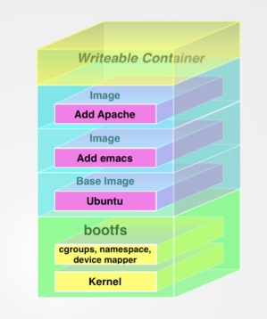

# What is Docker?

I've found that it can be difficult to understand what Docker is
just from a description. So let's dive right in and try to explain
with a quick example. You'll need to bring up _shellinabox_ (see 
below) in order to try the example.

## Using _shellinabox_

You are welcome to [install Docker](https://docs.docker.com/installation/)
on your own computer, but our Amazon Machine Images (AMIs) come with
Docker already installed. We can access it using 
[_shellinabox_](https://code.google.com/p/shellinabox/) which provides
most of the functionality of a terminal window in your web browser. 
To use it, open a new web browser window.

Your _shellinabox_ URL is the same as your RStudio URL but with
`:4200` added to the end. So if your RStudio URL is

    http://ec2-www-x-yyy-zz.compute-1.amazonaws.com

Then your _shellinabox_ URL is:

    http://ec2-www-x-yyy-zz.compute-1.amazonaws.com:4200

Go to that URL and log in with username `ubuntu` and password `bioc`.

## A quick example

before we do anything with docker, let's take a quick look at the
machine we are on. what operating system  is it running? to find out,
enter the command

    cat /etc/*-release

This tells us we are on Ubuntu Linux version 14.04.  Let's take a look
at what processes are running on the machine. Enter  the command

    ps aux

This will list a lot of processes, probably over 100, even
though we are hardly doing anything on the machine. The typical 
machine runs a lot of processes just for its basic operation.

Finally, let's see what files are in the current directory with

    ls

Now let's try this with Docker. Start a docker container with the 
command:

    docker run -ti --rm debian:latest bash

You'll see a prompt come up that looks something like this:

    root@bfd260cc3d02:/#

The first thing to notice is that this prompt came up instantly.

Let's try once again the command to see what operating system we are on:

    cat /etc/*-release

This tells us we are on Debian version 8.

Now let's look and see what processes are running, again with

    ps aux

This time it only reports two processes, our `bash` shell and our
`ps` command! 

Finally, type

    ls

to see what files are present. They are totally different files than the ones
we saw on the host machine.

To clean up, type 

    exit

to leave the container.

## What just happened?

We just demonstrated an essential aspect of Docker: the fact
that processes in a Docker container 
are _isolated_ from those of the host machine.
In fact, the Docker container we just started is running a totally
different Linux distribution (Debian vs. Ubuntu on the host).

And yet it's not a virtual machine; if it were, we'd expect to see
a whole bunch of processes on it, just like on a normal machine.
(Docker uses fairly recent advances in the Linux kernel called _cgroups_
and _namespaces_ to achieve this isolation.) So unlike a virtual
machine, we can take advantage of all the speed and hardware of 
the host machine.

So even though we were running a different Linux distribution
in our container (Debian) than on our host (Ubuntu), the container
was running in the same _kernel_ as the host. That explains why
the container started up so quickly.

Docker's filesystem is also isolated as we saw by running `ls`.

So that's Docker in a nutshell. Isolated processes and filesystem (and network too!).
When you see how Docker containers are created (in the next section)
you'll understand all the shipping container metaphors that get
tossed around with respect to Docker.

## Creating a container

Let's say I have created a revolutionary new application that
will change the world and bring me riches and fame. 
The application is a line of shell script that says:

    echo "Hello, world!"

But we can pretend it is a very complex application that has a lot
of operating system dependencies and is very difficult to build and
install. So I'd like to ship my application as a Docker container,
to save other users the pain of installing it. 

First I'll make a new directory and change to it:

    mkdir workspace
    cd workspace

I'd create a file called `Dockerfile` and put the following in it:

    FROM debian:latest
    CMD echo "Hello, world!"

Then I'd build the container with:

    docker build -t dtenenba/myapp .

Now the container can be run as follows:

    docker run dtenenba/myapp

Lo and behold, it spits out "Hello, world!". So now I can check my Dockerfile
into GitHub and anyone can build and run it. I could also push it
to [Docker Hub](https://hub.docker.com) (and I have) and then any user could get it 
(without needing to build it) by doing

    docker run dtenenba/myapp 

and the container will be pulled down from the server if it does not
already exist on the host. Or you could explicitly pull it (but not run it)
with

    docker pull dtenenba/myapp

Dockerfiles contain all the instructions necessary to set
up a container. Generally this consists of installing dependencies
(usually with a package manager) and other prerequisites.

See the full [Dockerfile reference](https://docs.docker.com/reference/builder/)
for more infromation.

(There's [another way](https://docs.docker.com/reference/commandline/commit/)
to create a Docker container, but it's not recommended, so I won't discuss it.
So there!)


## Dockerfiles and filesystem layers


By the way, I highly recommend [The Docker Book](http://www.dockerbook.com/)
by James Turnbull. It's available as a PDF and is updated frequently.
In fact, I like the book so much that I am just going to quote from it
fairly liberally about the Docker filesystem:

> In a more traditional Linux boot, the root filesystem is mounted read-
> only and then switched to read-write after boot and an integrity check
> is conducted. In the Docker world, however, the root filesystem stays
> in read-only mode, and Docker takes advantage of a 
> [union mount](https://en.wikipedia.org/wiki/Union_mount) to add
> more read-only filesystems onto the root filesystem. A union mount is
> a mount that allows several filesystems to be mounted at one time but
> appear to be one filesystem. The union mount overlays the filesystems
> on top of one another so that the resulting filesystem may contain
> files and subdirectories from any or all of the underlying
> filesystems. 
 
> Docker calls each of these filesystems images. Images can
> be layered on top of one another. The image below is called the parent
> image and you can traverse each layer until you reach the bottom of
> the image stack where the final image is called the base image.
> Finally, when a container is launched from an image, Docker mounts a
> read-write filesystem on top of any layers below. This is where
> whatever processes we want our Docker container to run will execute.

> This sounds confusing, so perhaps it is best represented by a diagram.



This diagram could be seen as another way to represent the following
Dockerfile:

    FROM ubuntu
    RUN apt-get install -y emacs
    RUN apt-get install -y apache2

The purple boxes in the diagram (read from bottom to top) match the 
lines in the Dockerfile. When Docker builds the Dockerfile, it creates
a new image (or filesystem layer) for each command in the Dockerfile.

# Use Cases

By now I hope you have a basic idea of what Docker is: an easy way to
package up an environment to include some application and all of its 
dependencies. Now perhaps we have enough information to speculate
about how Docker could help us:

* **Reliability**: Now we have a way to distribute applications
to other people, where the application should "just work." 
This should eliminate configuration and "works for me" problems.
Workflows can be given to sysadmins/cluster admins as Docker
containers and they don't need to know anything about 
what's in the containers, but can treat them as black boxes
that take input and produce output. No more waiting for
your sysadmin to install the latest version of R.
[Galaxy](https://usegalaxy.org/) tools can also be
defined as Docker containers.

* **Reproducibility**: You can run a workflow today and run it
again in a year using the _exact_ same environment. We'll discuss
this more later in the context of the Bioconductor containers.

* **Testing**: My workspace on my local computer changes every
day as I add and remove software, but for testing I need a 
consistent environment.

* **Separation of concerns**: Some applications consist of multiple
processes; thse can each run in their own Docker container.
We'll discuss how to do this a little later.

* **Cloud deployment**: Both [Amazon](https://aws.amazon.com/ecs/)
  and [Google](https://cloud.google.com/container-engine/) are 
  supporting Docker as a first-class citizen on their cloud platforms.


# Docker and Root Privileges

One big issue with Docker is that you need to be _root_ to run it,
because the kernel features that make Docker work require root
privileges. We haven't seen it in our examples so far because the
_ubuntu_ user on the AMI is a member of a group that has root
privileges for  certain operations. Normally, however, 
all _docker_ commands must be run as root or prepended by _sudo_.
(This is not necessary on Mac or Windows.)

This does present some problems. Not everyone (especially on shared
systems) has root privileges. Sysadmins may be reluctant to
run a container with unknown contents as root.

# What if I'm not on Linux?

You can still run Docker on Windows and Mac, via a lightweight
virtual machine called [Boot2docker](http://boot2docker.io/).
Just follow the instructions on the 
[Docker installation](https://docs.docker.com/installation/) page.

Windows 10 will include a form of Docker allowing you
to run Windows containers.


# Breaking into the black box

You might be thinking, "well, it's nice that I can have an application 
that says 'Hello world', but how do I get Docker to compute on my data?
How do I run a web application on docker?"

## Working with local files

Here's a quick Dockerfile that performs some operation on data on
my local computer. In this case, I want to make value judgements
about the files in a directory. The following Dockerfile
will do it:

    FROM debian:latest
    VOLUME /data
    WORKDIR /data
    CMD for i in `ls`; do echo $i is awesome; done

I can build it with

    docker build -t dtenenba/voldemo .

And run it like this:

    docker run -v /etc/:/data dtenenba/voldemo

The `-v` switch takes two directories (separated by a colon); the first one is a directory
on my local filesystem, the second can be thought of as a 'mount point' for that directory
inside the container. Affirmingly, the above command tells me that every file in my
`/etc` directory is awesome.

In this case, Docker is just listing the files, but it can perform write operations as well.
(Since Docker runs as root by default, its output files may not have the permissions you want;
read [Rocker's page](https://github.com/rocker-org/rocker/wiki/Sharing-files-with-host-machine)
on the subject for tips on getting around this).

## Exposing the network

This Dockerfile is a very simple web server, but it could be a complex web 
application:

    FROM debian:latest
    RUN echo "It works!" > index.html
    RUN apt-get update
    RUN apt-get install -y python
    EXPOSE 8000
    CMD python -m SimpleHTTPServer 8080

If you build it:

    docker build -t dtenenba/webdemo .

... and run it:

    docker run --name webserverdemo -p 8080:8080 dtenenba/webdemo

Similarly to the `-v` switch, the `-p` switch maps a port on the host to one on
the container. 

You can then open it in a web browser and see the riveting message.

### Knowing which URL to open

If you created this Dockerfile on your own Linux machine, you can just go to
[http://localhost:8080](http://localhost:8008). If you are using boot2docker
you can do something like this to get the URL:

    echo http://$(boot2docker ip):8000

If you are on this AMI, you can just append `:8080` to your RStudio URL, so
something like:

    http://ec2-www-x-yyy-zz.compute-1.amazonaws.com:8080

### Cleaning up

To stop the web server, you can press control-C, or open another window and issue
the command:

    docker rm -f webserverdemo

# Composing complex applications from multiple containers

A typical web application might involve several processes; for example, the
Bioconductor new package tracker consists of
a web application written in Python, a MySQL database, and an SMTP mail server.

Containers can be [linked together](https://docs.docker.com/userguide/dockerlinks/)
to facilitate scenarios like this. Two containers can communicate with
each other over network ports (without exposing their networks to the host!)

You can make an application like this out of multiple containers, one
for each process. (A docker application _can_ consist of multiple processes
inside a single container, but it's considered a best practice to just
run one process per container.)

Even better, for common applications like MySQL server, you can just
pull down a pre-existing container that's ready to go. You don't need
to create and build the MySQL server yourself. Similarly, there's 
an off the shelf web-app container that just receives email sent to it 
and displays it in a browser, ideal for testing the email
functionality of a web application.

Tying it all together is a tool called 
[Docker Compose](https://docs.docker.com/compose/) (formerly known as Fig).
This tool is not part of Docker and needs to be installed separately.

With a [YAML file](https://github.com/dtenenba/bioc_docker/blob/master/tracker.bioconductor.org/fig.yml),
we declare the dependencies between containers in
this application. Here's the real-life YAML file for the multi-container 
Docker app we use for testing the new package tracker:


```{r, echo=FALSE, comment=NA}
library(httr)
cat(x <- content(GET("https://raw.githubusercontent.com/dtenenba/bioc_docker/master/tracker.bioconductor.org/fig.yml")))
```


I won't dwell too much on details here (the complete app is
[on GitHub](https://github.com/dtenenba/bioc_docker/tree/master/tracker.bioconductor.org)),
 but this sets up the three containers
and all the information they need to communicate with each other. Each container
can access the relevant information by means of environment variables.
A single command (`docker-compose up`) turns on all three containers.

See the [docker-compose.yml reference](https://docs.docker.com/compose/yml/)
for more on this declarative syntax.


# Docker and R/Bioconductor

We've seen how Docker images can be built on top of one another:
our "Hello, World" application was built on top of _debian:latest_.
By the same token, the Bioconductor images are built on
top of R and RStudio images provided by the 
[Rocker](http://dirk.eddelbuettel.com/blog/2014/10/23/)
organization.


The [full documentation](http://bioconductor.org/help/docker/)
for these images is at the Bioconductor website.


For devel and release (and going forward, older releases), the following
containers are available (the actual container names start with `release_`
or `devel_` and end with one of the following):

* `base`: R and the `BiocInstaller` package (providing `biocLite()`)
* `core`: `base` plus core infrastructure packages
* `flow`: `core` plus all packages with the FlowCytometry biocView
* `microarray`: `core` plus all packages with the Microarray biocView
* `proteomics`: `core` plus all packages with the Proteomics biocView
* `sequencing`: `core` plus all packages with the Sequencing biocView


## Starting the containers

There are several ways to interact with the containers. The 
default way is to use RStudio Server. Entering the following
command:

    docker run -p 8787:8787 --rm bioconductor/devel_base

Will make RStudio Server available on port 8787 of the
host. So if your AMI URL is 

    http://ec2-www-x-yyy-zz.compute-1.amazonaws.com

Add `:8787` to the end:

    http://ec2-www-x-yyy-zz.compute-1.amazonaws.com:8787

The RStudio login is `rstudio` and the password is `rstudio`.

You can also start command-line R with this command:

    docker run -ti --rm bioconductor/devel_base R

Or if you plan to run other commands besides R inside
the container, start a bash shell:

    docker run -ti --rm bioconductor/devel_base bash

## Reproducibility

The key to reproducibility is to know exactly which
Docker image you are using so you (or others) can reuse it later.

Bioconductor's Docker images are tagged. For example, 
[here](https://registry.hub.docker.com/u/bioconductor/devel_base/tags/manage/)
are the available tags for the `devel_base` image.

There are three kinds of tags:

* Date tags (example: 20150713). The images are rebuilt
  every day. If the build is successful, the image
  is tagged with a string representing the current date.
  _This is the only kind of tag you should rely on 
  for reproducibility._
* Version tags (example: 3.2). With each daily build,
  the version tag is applied. This number refers
  to the Bioconductor version.
* The string `latest`. This tag is applied to each
  daily build of an image. Note that when running
  or pulling an image, by default you are pulling
  the `latest` tag of that image, unless you specify
  another tag, with (for example):

    docker pull bioconductor/devel_base:20150713

So an image can have multiple tags. If today is July 13,
2015, then the most recent `devel_base` image will
be tagged `20150713`, `3.2`, and `latest`. The
tag `20150713` will **always** apply to the same
image, but the other two tags do not. So for purposes
of reproducibility, you should always pay attention
to the date tag of the image you're using. If you didn't
start the image with a specific tag, you can determine
the tag of a running container with the `docker ps` command,
for example:

    docker run -ti --rm bioconductor/devel_base

And then in another window:

    $ docker ps
    CONTAINER ID        IMAGE                              COMMAND             CREATED             STATUS              PORTS               NAMES
    0af597a23632        bioconductor/devel_base:20150713   "bash"              6 seconds ago       Up 6 seconds        8787/tcp            happy_yalow

This tells me that I am using the image tagged 20150713.


# References

* [Dockerfile Reference](https://docs.docker.com/reference/builder/)
* [`docker run` reference](https://docs.docker.com/reference/run/)
* [Docker command line reference](https://docs.docker.com/reference/commandline/cli/)
* [Docker Compose](https://docs.docker.com/compose/)
* [Bioconductor Docker Page](http://bioconductor.org/help/docker/)
* [Reproducible Research using Docker and R](https://benmarwick.github.io/UW-eScience-docker-for-reproducible-research/#1)

